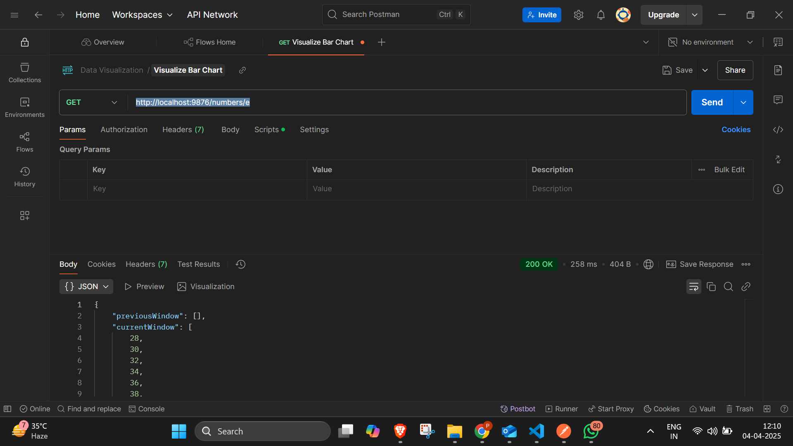

# Backend Assignment – Social Media API & Average Calculator

This Node.js project contains two microservices:

1. **Social Media API Client**  
   Interacts with the evaluation test server to fetch users, posts, and comments.

2. **Average Calculator**  
   A microservice that calculates a rolling average from numbers fetched from the test server.

---

## 🚀 Setup Instructions

### 1. Clone the repo

```bash
git clone https://github.com/saltypriya/E22CSEU0430.git
cd Assignment1 or Assignemt 2

